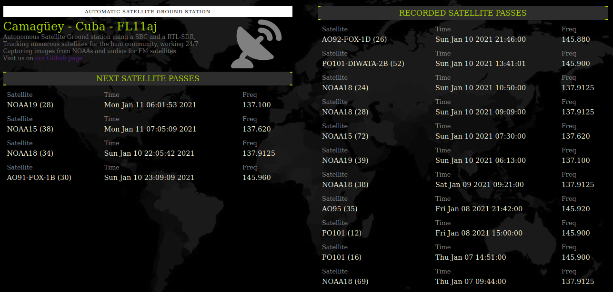
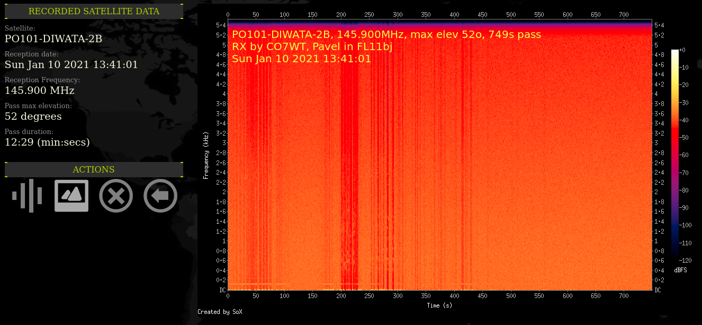
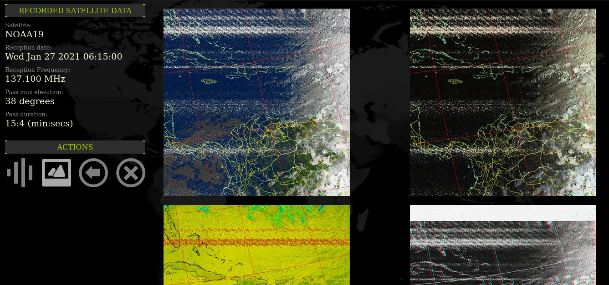

# Fully Automatic Amateur Satellite Ground Station

A setup to build a satellite ground stations that can tune, record and generate images for FM and APT weather satellites.

This is the software recipe, in the hardware part I used an [Orange Pi Prime Board](http://www.orangepi.org/OrangePiPrime/) but you can use any [Single Board Computer](https://en.wikipedia.org/wiki/Single-board_computer), including Raspberry Pis (Note: see section "Installation note in Raspberry Pi OS"), O-droids and even a normal PC or Server.

The only advice is to use one with a multiple cores and at least 1GB of RAM as some task are resource intensive.

I used [Armbian](https://www.armbian.com/) as OS, but you can manage it to make it work with [RaspiOS](https://www.raspberrypi.org/software/) or any other linux distro with a little of work.

A sample of the main view:



A sample view of a pass of PO-101 DIWATA-2B (FM sat):



A sample view of a pass of a NOAA weather APT satellite:



## Inspiration

This project is inspired and heavily based on the work of [Luick Klippel](https://github.com/luickk) and his work on his [NOAA Satellite Station](https://github.com/luickk/noaa_satellite_ground_station) repository.

## Features

- Web interface to see the next passes, the recorded ones, and details for it.
- Receive any satellite in FM mode *(SSB is possible but there is no doppler control yet, so no SSB by now)*
- Record the satellite pass and keep the audio for later.
  - APT WX audio is preserved in wav format and 22050 hz of sampling *(the format [wximage](https://wxtoimgrestored.xyz/) needs to work with)*
  - FM audio satellites is preserved in .mp3 mode but with high quality settings, and other tricks.
    - The spectrogram of the audio is embedded as album art *(see below)*.
    - The pass details and receiving station data are stored in the mp3 tags.
- Automatic decode APT images from WX sats (NOAA 15, 18 and 19)
- For the voice FM sats we craft a spectrogram and embedd the metadata of the pass on the image.

## Future features?

- Migrate to python3 for the main processing (doppler adjust, aka SSB tracking/recording?)
- Control a rotor via [Hamlib](https://hamlib.github.io/).
- Craft a solution to allow for doppler corrections while receiving *(will allow to receive SSB signals, at least for CW beacons)*
- Improve the mobile experience (responsive web) WiP...

## Installation steps

 **Warning:** all the installation steps mentioned here need root privileges, typically just making a `sudo -i` in the console to gain root is enough, or you can type `sudo` before any command.

### pre-installation requisites

As this tool relies on many tools I will not explain how to setup each one, but I will give you clues of where to get info about it.

- **Web server + PHP support**

You need a web server with php installed (at least version 7.x, no MySQL or MariaDB support needed), google has a lot of guides indexed, just google for "install nginx and php in [your-operating-system]"

**RaspiOS users**: If the web server works but does not process php files (try to download the index.php file instead of process & show) you must take a peek on this [tutorial](https://www.raspberrypi.org/documentation/remote-access/web-server/nginx.md) about how to enable php support for nginx.

- **Predict**

You need to install `predict` the software to make predictions of satellite passes.

For **RaspiOS / Raspbian**:

```sh
sudo apt install predict
```

For Armbian you need to compile it from source, you can get it from the [Predict home page](https://www.qsl.net/kd2bd/predict.html).

After installing predict you need to do this aditional step to make it run properly (install some files):

```sh
sudo -i
mkdir /root/.predict
cd /root/.predict
wget https://raw.githubusercontent.com/kd2bd/predict/master/default/predict.db
wget https://raw.githubusercontent.com/kd2bd/predict/master/default/predict.tle
wget https://raw.githubusercontent.com/kd2bd/predict/master/default/predict.qth
# Next step only if using a Rasberry Pi board
ln -s /root/.predict /home/pi/.predict
```

- **WXtoImage**

This wonderful piece of software was deprecated by the original authors but a group of enthusiast keep it alive in the [Restored WXtoImage](https://wxtoimgrestored.xyz/) site.

Just download it here: [WXtoImage deb package for ARM](https://www.wxtoimgrestored.xyz/beta/wxtoimg-armhf-2.11.2-beta.deb) or browse the site for other architectures.

To install it copy it to your SBC computer and run (Debian based distros):

```sh
sudo dpkg -i wxtoimg-armhf-2.11.2-beta.deb
# [ignore errors if any]
sudo aptitude install -f
# [this will fix any dependency error listed above]
```

As I mention this software is abandonware and if you search on the site you will find a generic register credentials.

To register the software in the SBC you need to install it on a linux box with an GUI (can be another SBC or a real linux box); run xwximage and fill your coordinates and settings, register with the credentials and just then locate a hidden file under your home directory called `.wxtoimgrc` and copy it to `/root/.wxtoimgrc` in the SBC. You are done.

- **Utilities**

You need at least `git` and `make`, in most linux (including SBCs) you are set by running this:

```sh
sudo apt install git make
```

- **Installation note in Raspberry Pi OS**

For some unknown reason the `rtl_fm` tool lacks the `-E wav` option as @takagiwa found, the solution is to compile the trl-fm from upstream, see [this comment](https://github.com/stdevPavelmc/FAASGS/issues/13#issuecomment-774592768) for details.

## Real install

- Login in your into SBC and clone this repository `git clone https://github.com/stdevPavelmc/FAASGS`.
- Change to the created folder `cd FAASGS`.
- Gain root access via `sudo -i`
- Run configuration steps `make cconf`.
- Configure your local data (see [Configuring](#configuring) below)
- Run install script `make install`.
- Execute it by hand to check if all works `sats.sh`.
  -  Go to your IP address and check if there is any 'next pass' scheduled.
- If all gone ok, run the schedule script to make it run for good `make permanent`

## Configuring

After the configure step you need to modify your local data, you callsign (use N0NAME if you are not a ham radio operator), name, locator (use [this tool](https://www.iz3mez.it/maps.google/ww-loc.html) if you are in doubt), coordinates (use locator tool to check the coordinates too), QTH and the satellites you want to capture.

Just go to `/etc/sat_data` and edit a file named `user.conf` with the command `sudo nano user.conf` to fill your data.

You will find a proxy setting there to, if you don't use a proxy just leave it as is, if you use a proxy then follow the comments.

Next step is to select the satellites you want to monitor, the file is named `sats.json` and it has a very common web format, you can add or remove sats as your need.

Use `sudo nano sats.json` to edit the file, it came by default with all the working NOAA satellites and the working VHF ones, but if you have a dualband antenna you can introduce some UHF sats also.

Please note that the satellites has a name and a nickname, the name refers to the one that appears in the TLE file and the nickname is a friendly name for us (and must not contain spaces, parenthesis, slashes, etc)

## Upgrading

This software is designed to be upgradeable with little eforts, just follow this steps:

- Login into your SBC and change to the folder you cloned the repository in the past.
- Gain root access via `sudo -i`
- Update the software with this command `git pull` if there is an update you will be notified about the files that has changed.
  - If you get a warning about it can merge the data, just do this `git reset --hard` tha twill reset the tree then repeat the `git pull`. 
- Clean the workspace with this command `make clean`
- Install the new version of the software `make install`.
- Make it permanent with `make permanent`.

## Removing

If you need to remove the software there is a command for that `make remove`, but all the collected data will be preserved in the `/var/www/html/sat` folder, you will be warned about it.

## A word about the RF part: Antennas!

I have not spoken about antennas and RF in this document because that relies on your expertice, I will mentioned my experience with some and I trust your internet skills to find them

- A 2m J-pole: normal for voice FM sats, bad for APT images (the image of PO-101 above was taken with just a  J-pole + 12m of RG-8X)
- A horizontal 120 degrees V for APT satellites (137 Mhz): better for APT, regular-to-bad for voice FM satellites
- A 1/4 wave 2m ground plane (120 degrees elements) regular for 2m voice, regular for APT and regular-good for 70cm sats (yes, it works on 70cm too)
- The mentioned V + a custom VHF wide LNA (about +8 dB on 137 and 145 Mhz): very good for APT, normal-to-good for voice FM sats *(actual antenna I'm using now)*

As usual, the higher and un-obstructed view for the antenna the better, also for coax: top quality ones and as short as possible.

## This is FREE SOFTWARE!

Free as in freedom, no payment are needed, see the LICENCE file for details.

If this is software is of any utility to you; please consider to make a donation to keep me improving it, see [Contributing](Contributing.md) file for details.

## Contributing

You can improve the software, appoint bugs or fails, donate equipment or money, top up my cell phone, or just share your impressions on social media; details for all of that in the [Contributing](Contributing.md) file.

Any contribution is welcomed.
